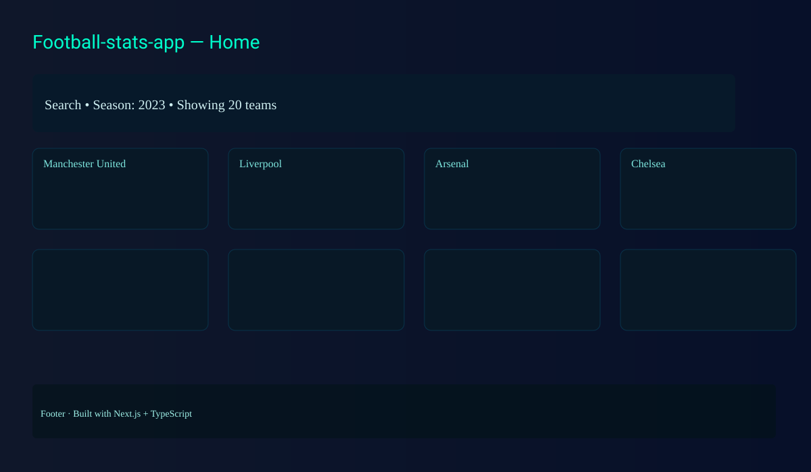
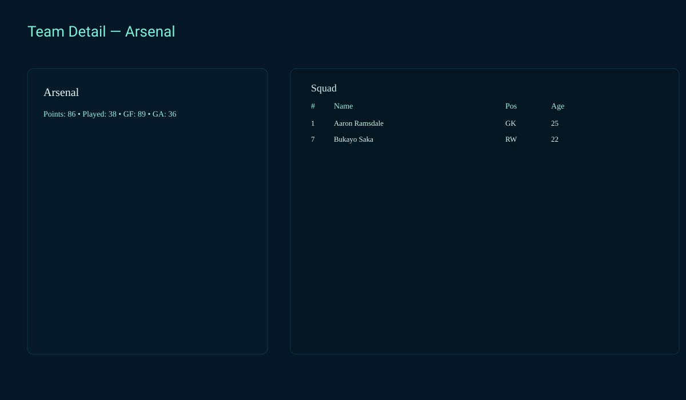
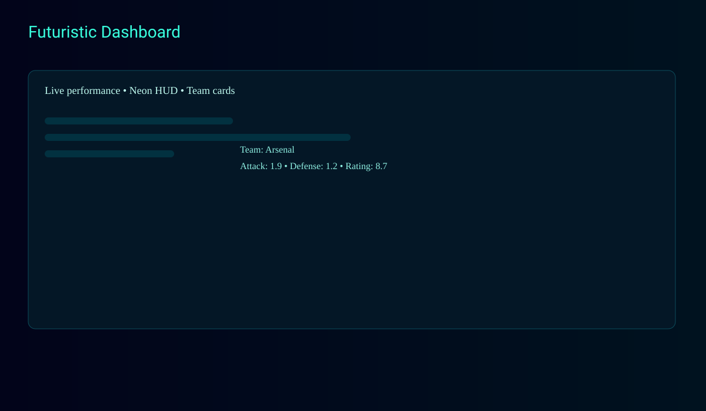
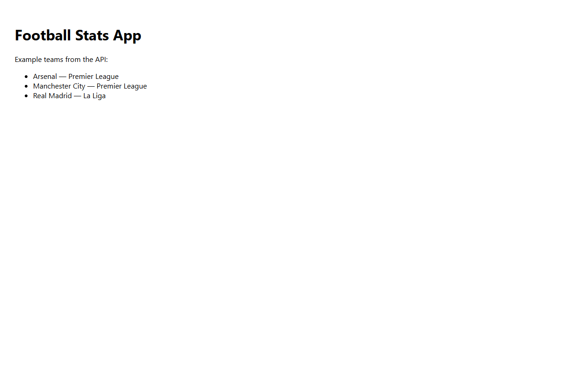
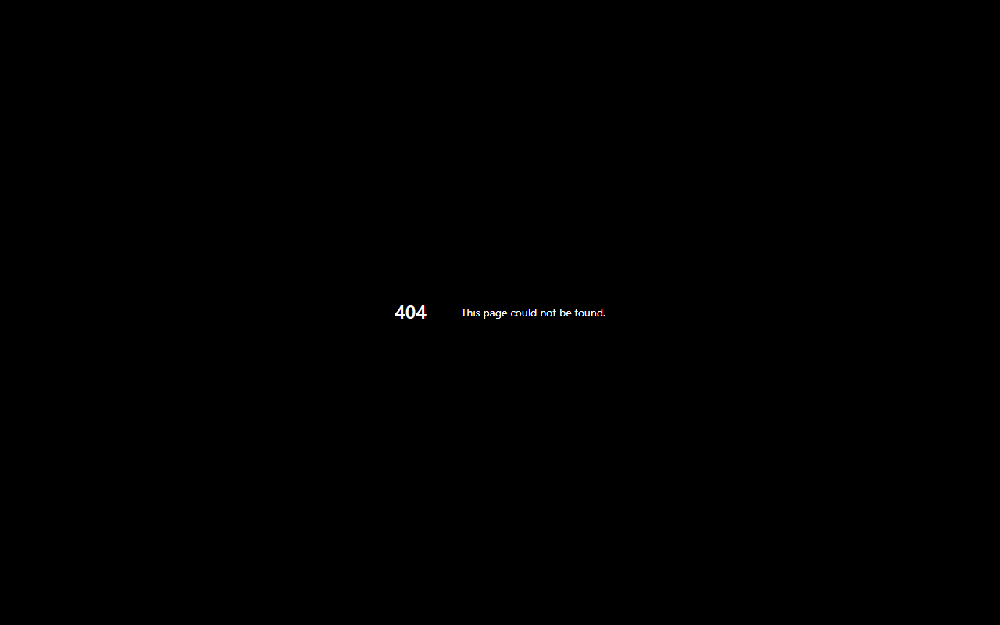

# Football-stats-app
An app for easily viewing football players' stats for the season.

Screenshots
-----------

Preview screenshots are included in the `screenshots/` folder. These are simple SVG previews that show the app's homepage, a team detail view, and the futuristic dashboard.







Photographic screenshots
------------------------

If you generated PNG screenshots using the included Puppeteer script, they appear here for a photographic preview of the live app:






This repository contains a minimal Next.js + TypeScript starter scaffold created so you have a runnable app to iterate on. The scaffold includes a simple frontend, an example API route and Docker + CI helpers to deploy quickly.

## Fan Features

- **Live Scores Ticker**: Real-time match updates from top leagues via OpenLigaDB API.
- **Fantasy Points Calculator**: Input your squad's goals/assists to compute fantasy points (goals=6pts, assists=3pts). Visualize with charts.
- **Match Predictor**: AI-powered odds using team ratings and form. Predict win/draw/loss probabilities.
- **News Feed**: Latest football news from BBC RSS feeds.
- **Dark/Light Mode**: Toggle between neon purple dark theme and light mode.
- **PWA**: Install as app for offline access.
- **Infinite Scroll**: Smooth loading of 2k+ teams.
- **Accessibility**: ARIA labels, keyboard navigation, voice search.
- **Personal Dashboard**: Watchlist and favorites (auth coming soon).
- **Sharing**: Export team stats as images or tweets.
- **Community Polls**: Vote on football debates.
- **Team Comparison**: Radar charts for side-by-side team analysis.
- **Player Trends**: Line graphs for player performance over seasons.
- **Scouting Tool**: Advanced search filters for players (age, position, rating).

## Data Source

This app uses [salimt/football-datasets](https://github.com/salimt/football-datasets) as the primary data source, providing comprehensive football data including 92,000+ players and 2,175+ teams worldwide. Data is automatically updated weekly via GitHub Actions.

To manually update data:
```powershell
npm run update-data
```

Quick start (Windows PowerShell):

```powershell
# install dependencies
npm ci

# run dev server
npm run dev
```

API:
- `GET /api/teams` - returns a list of teams. By default the route returns an example list. You can configure it to use real data from API-Football (APISports) by setting an environment variable — see "Using API-Football" below.

Files of interest:
- `pages/index.tsx` — simple UI that fetches the API
- `pages/api/teams.ts` — example API route
- `package.json` — scripts to run/build the app (see `dev`, `build`, `start`, `docker:build`, `docker:up`)

Next steps:
- Replace placeholder API with real football stats data source
- Add tests, linting rules, and stricter TypeScript settings

Using API-Football (optional)
--------------------------------

This project can be configured to use API-Football (APISports, v3) for real team data. Follow these steps to enable it locally and in deployments:

1. Sign up at https://www.api-football.com/ (APISports) and obtain an API key for the v3 endpoints.
2. Add the API key to your environment. Locally create a file named `.env.local` at the project root with the following content:

```text
# .env.local (project root)
API_FOOTBALL_KEY=your_api_football_key_here
# Optional: change league and season (defaults to Premier League id 39 and season 2024)
API_FOOTBALL_LEAGUE_ID=39
API_FOOTBALL_SEASON=2024
```

Note: Next.js reads `.env.local` entries automatically (use `process.env.API_FOOTBALL_KEY` in server code). When deploying (for example to Vercel), set `API_FOOTBALL_KEY` in your project's environment variables in the hosting dashboard.

Using NewsAPI for Team News (optional)
-------------------------------------

This project uses NewsAPI.org for up-to-date team news in the team detail pages. Follow these steps to enable it:

1. Sign up at https://newsapi.org/ and obtain an API key (free tier: 100 requests/day).
2. Add the API key to your environment. Locally create a file named `.env.local` at the project root with the following content:

```text
# .env.local (project root)
NEWSAPI_KEY=your_newsapi_key_here
```

When deploying, set `NEWSAPI_KEY` in your hosting platform's environment variables.

The news API caches results for 30 minutes to respect rate limits.

Behavior and caching
- The `GET /api/teams` route will try to fetch from API-Football when `API_FOOTBALL_KEY` is present. If the external API call fails or the key is not provided, the endpoint falls back to a small example dataset so the UI keeps working.
- The server uses a short in-memory cache (1 hour TTL) to reduce requests to the free tier API. API responses also include Cache-Control headers so CDNs or serverless platforms can cache responses for 1 hour (`s-maxage=3600, stale-while-revalidate=60`).

Standings & season
- The `/api/teams` endpoint now uses the standings endpoint to return expanded team objects (points, played, GF/GA, attack/defense per-match, rating and form). By default it targets Premier League (league id `39`) and season `2025`. You can override via query params: `/api/teams?league=39&season=2025`.

Security
- Never commit your API keys. Use `.env.local` for local development and platform secrets for CI or production.

Running tests
------------

This project includes a basic Jest + Testing Library setup and a small test for `TeamList`.

After you update `package.json` you'll need to install new dependencies:

```powershell
npm ci
```

Then run the tests:

```powershell
npm test
```

Note: the repository's `package.json` was updated to include Recharts and Jest dependencies. Run `npm ci` to install them before running the app or tests.

Docker

Build and run with Docker (requires Docker installed):

```powershell
# build the image
npm run docker:build

# or start with docker-compose
npm run docker:up

# stop
npm run docker:down
```

Deploy to Vercel (recommended for Next.js)
----------------------------------------

1. Create a GitHub repository and push this project to it.
2. Go to https://vercel.com/new, import your GitHub repo and deploy — Vercel auto-detects Next.js.
3. Optionally set environment variables via the Vercel dashboard (e.g., `FOOTBALL_API_KEY`).

Automatic deploy via GitHub Actions
----------------------------------

This repo includes a workflow `.github/workflows/deploy-vercel.yml` that will run on pushes to `main` and deploy the project to Vercel using the Vercel CLI.

Before using it, add the following repository secret in GitHub: `VERCEL_TOKEN` (create one in your Vercel account settings -> Tokens).

When you push to `main`, GitHub Actions will run the deploy workflow and publish the site to your connected Vercel project.

CI: A minimal GitHub Actions workflow is provided in `.github/workflows/ci.yml` which installs dependencies and runs `npm run build` on pushes and PRs.

Automated screenshot capture
----------------------------

You can generate PNG screenshots for the repo's `screenshots/` folder using a small Puppeteer script. This is handy for producing photographic previews to include in the README.

1. Install Puppeteer (one-time):

```powershell
npm ci
npm i --save-dev puppeteer
```

2. Start the dev server in a separate terminal (so the script can visit the pages):

```powershell
npm run dev
```

3. Run the screenshots script (it defaults to http://localhost:3000 but you can set APP_URL to point elsewhere):

```powershell
npm run screenshots
# or set APP_URL to capture a deployed preview
$env:APP_URL='https://your-deployment.example.com'; npm run screenshots
```

The script will write `screenshots/homepage.png`, `screenshots/team-detail.png`, and `screenshots/futuristic.png`.

## Landing Page Revamp
- **Hero carousel for instant hooks**: Rotating featured matches, transfer rumors, and player spotlights with Embla Carousel.
- **Infinite teams grid**: Virtualized with react-window for 500+ teams, load more pagination.
- **Live sidebar with international games**: Persistent collapsible ticker polling /api/livescores every 30s, including friendlies.
- **Dynamic period banners**: Framer Motion animations for transfer windows and breaks.
- **Enhanced search**: Fuse.js autocomplete with team previews on hover.
- **Sparkle effects**: High-rating teams get ✨ animations.
- **Quick stats dashboard**: Horizontal scroll cards with Recharts leader tables.

## New Features
- **Team Tabs**: Overview with radar charts, Squad with formation visualization and player table, News feed from NewsAPI, Fixtures timeline, Transfers carousel.
- **Banner Slideshow**: Dynamic rotating images of team badges, jerseys, fan art, stadiums from TheSportsDB.
- **Live Data**: Hybrid data source merging CSV with Football-Data.org standings for fresher ratings and points.
- **Periods**: Dynamic alerts for transfer windows, international breaks, AFCON, World Cup via global banner.
- **433 Vibes**: Highlights from YouTube RSS, personalized dashboard with polls and favorites, social sharing.

## Fixes & Features
- **Images**: Team logos sourced from TheSportsDB API with caching; player photos fallback to UI avatars; dynamic banners generated with html2canvas.
- **Ratings**: Robust calculation using position-weighted stats (GK/DEF/MID/FWD), goal difference, and aggregated player data.
- **Teams Display**: Homepage shows top 20 ranked teams; dedicated /teams page with infinite scroll, filters, and full list.
- **Additional Integrations**: Live scores ticker, fantasy league calculator with Recharts viz, PWA support for offline access.


